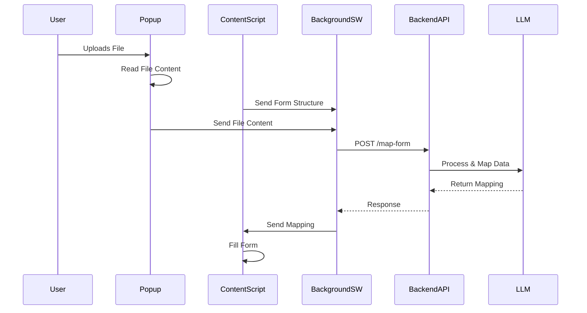

# Chrome Extension + LLM Backend Integration Architecture

## System Components

### Chrome Extension
- **Popup (`popup.jsx`)**  
  - Handles file upload (drag-and-drop)
  - Displays status messages
  - Communicates with Background Service Worker

- **Content Script (`content.js`)**  
  - Identifies form fields on web pages
  - Fills form fields based on mapping instructions
  - Detects form structure changes (for future multi-step forms)

- **Background Service Worker (`background.js`)**  
  - Coordinates communication between components
  - Handles API calls to backend
  - Manages error recovery

### Backend Service
- **API Server (Fastify)**
  - `/map-form` endpoint
  - API key authentication
  - Request/response validation

- **LLM Integration (Vercel AI SDK)**
  - File content parsing
  - Data mapping to form fields
  - Error handling

## File Handling Pipeline



## Implementation Phases

### Phase 1: Core Functionality (POC)
1. Backend setup with Fastify + Vercel AI SDK
2. Chrome extension components:
   - Popup file handling
   - Content script form detection
   - Background service worker coordination
3. Basic API contract implementation
4. Initial testing with Excel files

### Phase 2: Enhancements
1. Performance monitoring integration
2. Error handling refinement
3. Support for additional file types (CSV, TXT)

### Future Considerations
- Multi-step form handling
- Dynamic form updates
- Advanced state management

## API Contract

**Endpoint:** `POST /map-form`

**Request:**
```json
{
  "fileContent": "base64_or_string",
  "fileType": "xlsx",
  "formStructure": [
    {"name": "field1", "label": "Field 1", "type": "text"}
  ]
}
```

**Success Response (200):**
```json
{
  "mapping": {
    "field1": "value1"
  }
}
```

**Error Response (400/500):**
```json
{
  "error": {
    "code": "MAPPING_FAILED",
    "message": "Detailed error message"
  }
}